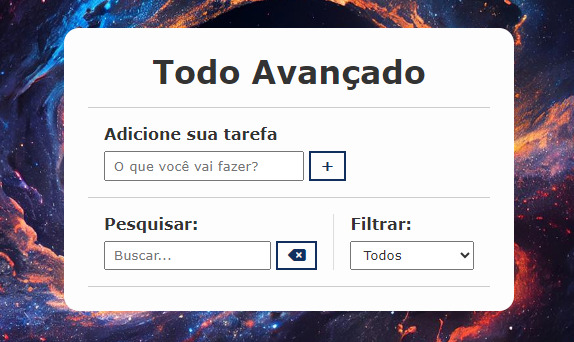

# td_list

  
Este projeto tem como objetivo proporcionar uma compreensão mais profunda sobre a estruturação de projetos web, além de explorar conceitos fundamentais de CSS e JavaScript. A sua finalidade principal é criar uma lista de eventos, oferecendo uma oportunidade para exercitar os fundamentos da web e consolidar o aprendizado em desenvolvimento front-end.
 
# indicie
 
* [Introdução](#introdução)
* [Como usar](#Como-usar)
* [Explanação](#explanação-de-codigos)
* [Tecnologias-utilizadas](#tecnologias-utilizadas)
* [Sites-utilizados](#sites-utilizados)
* [Referencia](#referencia)
* [Detalhes](#detalhes)

## Introdução

Este projeto visa explorar a estruturação de projetos web, CSS e JavaScript através da criação de uma lista de eventos. Durante a atividade, foram realizadas ações básicas, como envio de fghjormulários, marcação de tarefas como concluídas, edição ou exclusão, além de pesquisa em campo de busca e aplicação de filtros.

# Como Usar

A utilização da aplicação é simples: basta abrir o arquivo index.html em um navegador compatível. A partir daí, o usuário pode adicionar, marcar como concluídas, editar ou excluir tarefas, realizar pesquisas por tarefas específicas e aplicar filtros por status.

# Explanação dos códigos

Uma variedade de funções JavaScript desempenhou papéis cruciais em diferentes aspectos do projeto.

* 'saveTodo' desempenhou um papel central na criação de novas tarefas, além de permitir a marcação como concluídas, edição e exclusão, com armazenamento local integrado.

* 'ToggleForms' trouxe flexibilidade ao alternar entre os formulários de adição e edição de tarefas.

* 'updateTodo' foi essencial para atualizar os títulos das tarefas editadas.

* 'getSearchedTodos' e 'filterTodos' foram introduzidas para simplificar a busca e a filtragem de tarefas com base no texto inserido ou na opção selecionada.

 Essas funções trabalharam em conjunto para aprimorar a experiência do usuário e a eficiência do sistema como um todo.

# Tecnologias utilizadas:

* HTML5
* CSS 3
* JavaScript 

# Referência

O projeto foi inspirado e embasado em um vídeo cativante que está disponível neste link. Mantendo a estrutura e os insights fornecidos, realizamos algumas adaptações criativas para tornar a experiência ainda mais envolvente e significativa.

* video: https://youtu.be/HSssE1PRQcA?si=Nw4SlpbrjLWE7iml